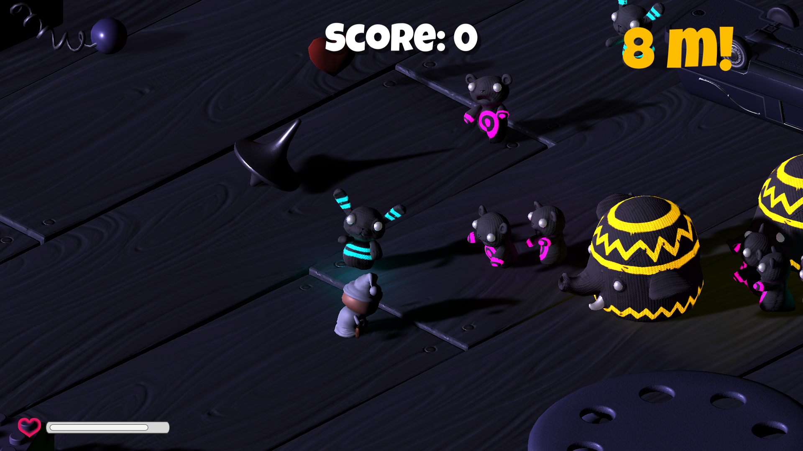
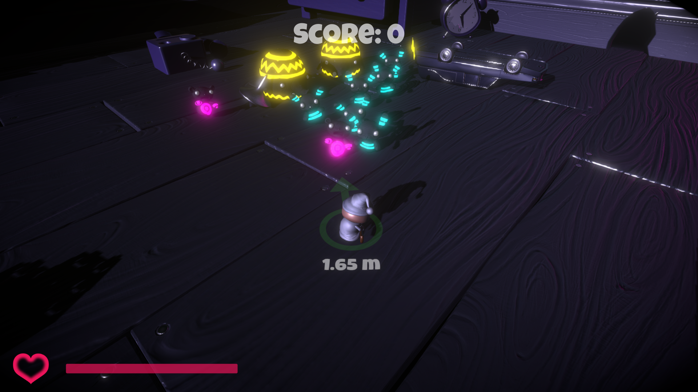
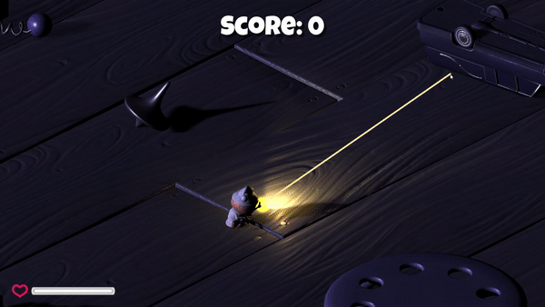
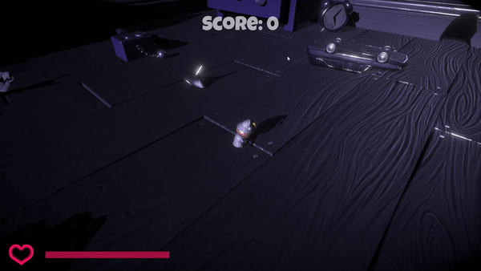

# Survival Shooter
3rd person shooter zombie survival game using Unity.

## Improvements
From the base tutorial I make some improvements which are:
- Refactor base code so that each script has single purpose responsibility (especially GameManager script), less reference call for unnecessary purpose (PlayerHeart script being referenced all over other scripts), add safety check when using `GetComponent` method
- Implement dynamic camera that doesn't just hard follow player but there are also some dampings and other viewing angles such as kill cam and death cam
- Use object pooling on some objects (e.g. bullets and power ups) to improve performance
- Apply post-processing effects like bloom and vignette to add more cinematic feels and glow on some materials
- Implement better bullet trail that is not just a line from point A to point B, but actual object that travels from point A to point B
- Implement better enemy detection system that checks only for enemies and can show the direction of the most nearby enemy
- Implement better spawning system so that each enemy type has certain rarity to spawn and the spawn rate increases as the time goes by
- Update some particles systems
- Implement bullet time effect that slows down time, change camera angle, and change audio pitch accordingly. This effect can be triggered manually but is also automatically triggered with 30% chance for every 5th enemy you killed

## Asset
I use custom skybox that I got from Unity Asset Store (<a href=https://assetstore.unity.com/packages/2d/textures-materials/sky/spaceskies-free-80503>Spaceskies Free</a>).

## Showcases
### Postprocessing
| Vanilla Version              |  My Version                   |
:-----------------------------:|:------------------------------:
  |  

### Bullet Trail
| Vanilla Version              |  My Version                   |
:-----------------------------:|:------------------------------:
  |  

### Warning System
| Vanilla Version              |  My Version                   |
:-----------------------------:|:------------------------------:
  |  

### Bullet Time Effect

### Death Cam

## Controls
- Move Up: W
- Move Down: S
- Move Left: A
- Move Right: D
- Shoot: Left Click
- Trigger Bullet Time: Left Ctrl

## Notes for Assistant / Examiner
When making this game, I <b>don't</b> fully follow along the tutorial and here's why:
- I <b>understand</b> the point of using the factory pattern however in the tutorial, the implementation is somewhat pointless. If anything, it just makes it more difficult to implement without any clear advantages. So, I implement my own spawning system using serializable `struct`. See [EnemySpawner.cs](Assets/Scripts/Enemy/EnemySpawner.cs).

- The use of command pattern here also doesn't make sense because the game doesn't really need undo/replay mechanics. The tutorial also doesn't disable the original player movement script that handles the input so everything the user inputs will be processed twice by `InputHandler` and `PlayerMovement` that creates weird behaviour and makes the game laggy. With those reasons, I decided to disable the `InputHandler` but the scripts are still there if you want to check it.

However, if the purpose of the tutorial is just to introduce us to command and factory pattern, then nevermind. But, perhaps you can use another tutorial (not the Survival Shooter) to better exemplify the concepts.

All build results is located in the <a href=https://github.com/SteveImmanuel/survival-shooter-unity/releases>release</a> page.
